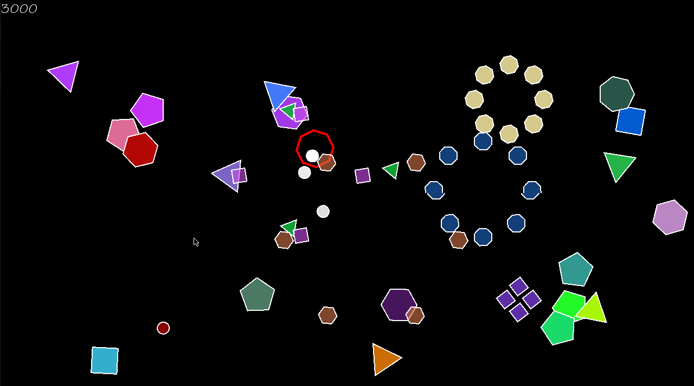

# Devcontainer-cpp Setup Guide

## Overview

This guide provides instructions for setting up the development environment for `devcontainer-cpp` on Windows using Docker. The steps also include optional instructions for setting up XServer for GUI visualization.

## Setup Steps

### 1. Install Docker

Follow the [official Docker installation guide](https://docs.docker.com/desktop/install/windows-install/) to install Docker on your Windows machine.

### 2. Install Visual Studio Code

- Install Visual Studio Code.
- Install the Remote Development extension.
- Open VSCode, press `Ctrl + Shift + P`, type 'dev containers: Clone Repository in Container Volume,' and clone this repository.
- Allow some time for the download and installation of the container.

## Optional: Setting up XServer

If you want to visualize the GUI from Docker in Windows, follow the steps in [this YouTube tutorial](https://www.youtube.com/watch?v=BDilFZ9C9mw) to set up XServer. Ensure you have XServer installed.

## Running the Application

To run the application, execute the following commands in the terminal:

```bash
git submodule update
mkdir build
cd build
cmake ..
make
./bin/sfml-app
```

To run the tests, execute the following commands in the terminal:

```bash
mkdir build
cd build
cmake ..
make
./bin/sfml-app-tests
```



------------------------------------------------------------------------------------------------
# Program Specification based on 4300 course
------------------------------------------------------------------------------------------------
In this assignment you will be writing the game that was presented in class.
This game must have the following features:

Player:
- The player is represented by a shape which is defined in the config file
- The player must spawn in the center of the screen at the beginning of the
game, and after it dies (collides with an enemy)
- The player moves by a speed read from the config file in these directions:
Up: W key, Left: A key, Down: S key, Right: D key
- The player is confined to move only within the bounds of the window
- The player will shoot a bullet toward the mouse pointer when the left mouse
button is clicked. 
- The speed, size, and lifespan of the bullets are read
from the config file.

Special Ability
- You are free to come up with your own 'special move' which is fired by
the player when the right mouse button is clicked.

This special ability must:
- Multiple entities (bullets etc) spawned by special weapon.
- Entities have some unique graphic associate with them.
- A unique game mechanic is introduced via a new component.
- A 'cooldown timer' must be implemented for the special weapon
  
The properties of the special move are not in the config file.

Enemy (s):
- Enemies will spawn in a random location on the screen every X frames,
where X is defined in the configuration file.
- Enemies must not overlap the sides of the screen at the time of spawn.
- Enemies shapes have random number of vertices, between a given minimum and
maximum number, which is specified in the config file.
- Enemy shape radius will be specified in the configuration file.
- Enemies will be given a random color upon spawning.
- Enemies will be given a random speed upon spawning, between a minimum and
maximum value specified in the config file.
- When an enemy reaches the edge of the window, it should bounce off in
the opposite direction at the same speed.
- When (large) enemies collide with a bullet or player, they are destroyed,
and N small enemies spawn in its place, where N is the number of vertices
of the original enemy. Each small enemy must have the same number of
vertices and color of the original enemy. These small entities travel
outward at angles at a fixed intervals equal to (360/ vertices).
For example, if the original enemy had 6 sides, the 6 smaller enemies will
travel outward in intervals of (360/6) = 60 degrees.

Score:
- Each time an enemy spawns, it is given a score component of N*100, where N
is the number of vertices it has. Small enemies get double this value.
- If a player bullet kills an enemy, the game score is increased by the score
component of the enemy killed.
- The score should be displayed with the font specified by the config file in
the top-left corner of the screen.

Drawing:
- In the render system, all entities should be given a slow rotation, which
makes the game look a little nicer.
- Any special effects which do not alter game play can be added for up to
5% bonus marks on the assignment. Note that assignments cannot go above
100% total marks, but the 5% bonus can overwrite any marks lost in other
areas of the assignment.
- Any Entity with a lifespan is currently alive, it should have its Color
alpha channel set to a ratio depending on how long it has left to live.
For example, if an Entity has a 100 frame life span, and it has been alive for
50 frames, its alpha value should be set to 0.5 * 255. The alpha should go from
255 when it is first spawned, to 0 on the last frame it is alive.

Misc:
- The 'P' key should pause the game
- The 'ESC' key should close the game.
  
### Configuration File:

The configuration file will have one line each specifying the window size,
font format, player, bullet specification, and enemy specifications.
Lines will be given in that order, with the following syntax:

#### Window WH FL FS

-This line declares that the SFML Window must be constructed with width W
and height H, each of which will be integers. FL is the frame limit that the window should be set to, and FS will be an integer which specifies whether to display the application in full-screen mode (1) or not (0).

#### Font F S R G B
- This lines defines the font which is to be used to draw text
for this program. The format of the line is as follows:

| Property  | Variable  | Type          |
| --------- | --------- | ------------- |
| Font File | F         | std::string   |
| Font Size | S         | int           |
| RGB Color | (R, G, B) | int, int, int |

#### Player Specification:

| Property          | Variable   | Type          |
| ----------------- | ---------- | ------------- |
| Shape Radius      | SR         | int           |
| Collision Radius  | CR         | int           |
| Speed             | S          | float         |
| Fill Color        | FR, FG, FB | int, int, int |
| Outline Color     | OR, OG, OB | int, int, int |
| Outline Thickness | OT         | int           |
| Shape Vertices    | V          | int           |

#### Enemy Specification:

| Property          | Variable   | Type          |
| ----------------- | ---------- | ------------- |
| Shape Radius      | SR         | int           |
| Collision Radius  | CR         | int           |
| Min/Max Speed     | SMIN, SMAX | float, float  |
| Outline Color     | OR, OG, OB | int, int, int |
| Outline Thickness | OT         | int           |
| Min/Max Vertices  | VMIN, VMAX | int, int      |
| Small Lifespan    | L          | int           |
| Spawn Interval    | SI         | int           |

#### Bullet Specification:

| Property          | Variable   | Type          |
| ----------------- | ---------- | ------------- |
| Shape Radius      | SR         | int           |
| Collision Radius  | CR         | int           |
| Speed             | S          | float         |
| Fill Color        | FR, FG, FB | int, int, int |
| Outline Color     | OR, OG, OB | int, int, int |
| Outline Thickness | OT         | int           |
| Velocity          | VL         | float         |


----------------------------------------------------------------
# Assignment Hints

## Step 0: Save Configuration File Reading

Delay the implementation of configuration file reading until later stages of development, focusing first on essential functionality.

## Step 1: Implement the Vec2 Class

Create a `Vec2` class to represent 2D vectors, which will be used for various components in your game.

## Step 2: Implement EntityManager Class

Implement the basic functionality of the `EntityManager` class. Focus on the `addEntity()` and `update()` functions to allow quick testing of the `Game` class. Don't worry about deleting dead entities in the `update()` function at this stage.

## Step 3: Implement Basics of the Game Class

a. Construct a player entity using the `spawnPlayer()` function.  
b. Implement basic drawing of entities using the `Game::sRender()` function.  
c. Construct some enemies using the `spawnEnemy()` function.  
d. Construct a bullet using the `spawnBullet()` function.

## Step 4: Implement Player Movement

Implement player movement in the `Game::sUserInput` and `Game::sMovement` functions. This ensures basic control over the player entity.

## Step 5: Implement EntityManager::update()

Now, focus on implementing the `EntityManager::update()` function to handle the deletion of dead entities.

## Step 6: Implement EntityManager::getEntities(tag)

Implement the `EntityManager::getEntities(tag)` functionality to retrieve entities based on their tags.

## Step 7: Implement Collisions

Implement collision detection in the `Game::sCollision` function. If an entity is considered dead due to a collision, call `entity.destroy()`.

## Step 8: Implement Rest of the Game's Functionality

Finish implementing the remaining game functionality, including reading configuration files. Now that the basic mechanics are in place, you can add more advanced features and polish.

This step-by-step approach should help you gradually build your game, ensuring that each component is functional before moving on to the next.
